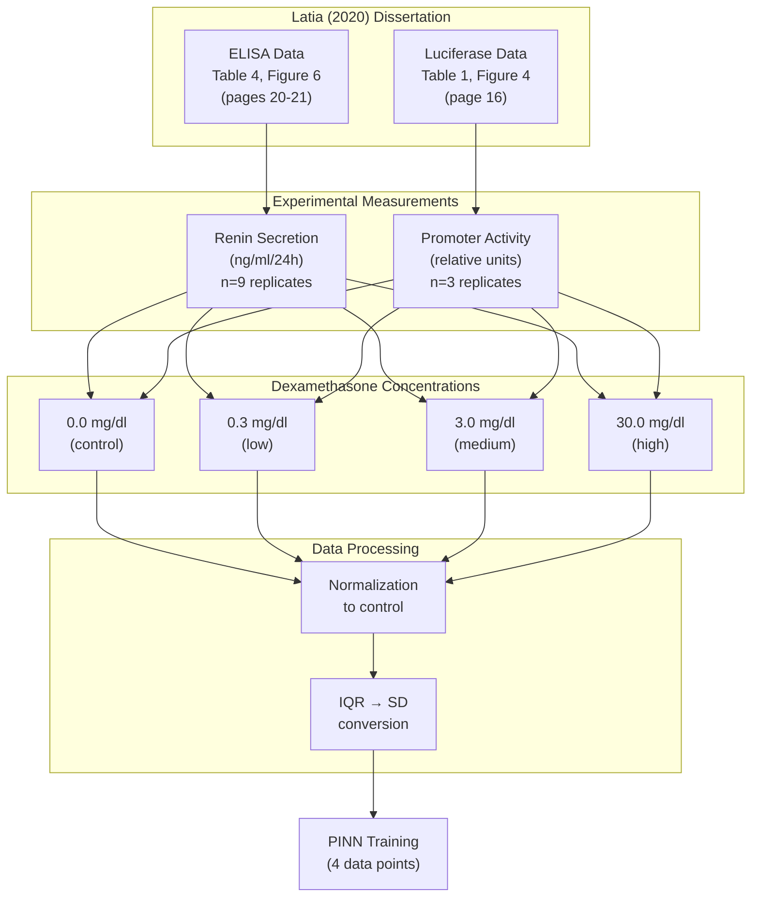

# Modeling Glucocorticoid-Induced Renin Regulation from Sparse Data Using Physics-Informed Neural Networks

[](LICENSE)
[](https://www.python.org/downloads/)
[](https://pytorch.org/)
[](https://github.com/jurjsorinliviu/PINN-Modeling-of-Glucocorticoid-Renin-Regulation)
[](https://codespaces.new/jurjsorinliviu/PINN-Modeling-of-Glucocorticoid-Renin-Regulation)

## Overview

This repository contains the implementation of **Physics-Informed Neural Networks (PINNs)** for modeling glucocorticoid-induced renin regulation from sparse experimental data. Our approach demonstrates how PINNs can learn complex biological dynamics with only **4 data points** while maintaining biological plausibility through physics-based constraints.

### Key Achievement

We developed a **PINN ensemble** that achieves **R² = 0.803 ± 0.015** on experimental data while respecting underlying ordinary differential equations (ODEs) governing glucocorticoid receptor dynamics, substantially outperforming a traditional ODE baseline (R² = -0.220).

### Research Highlights

- 📊 **Sparse Data Learning**: Achieves high accuracy with only 4 experimental observations
- 🧬 **Biology-Informed**: Incorporates 6-state ODE system for glucocorticoid receptor dynamics
- 🎯 **Parameter Estimation**: Accurately estimates IC50 (2.925 ± 0.012 nM) and Hill coefficient (1.950 ± 0.009)
- 📈 **Ensemble Approach**: Statistical validation through multiple model training with plausibility checks
- 🔬 **Synthetic Weight Optimization**: Balances data accuracy vs. biological parameter alignment (SW=0.3 optimal)

---

## Table of Contents

- [Features](#features)
- [Repository Structure](#repository-structure)
- [Installation](#installation)
- [Quick Start](#quick-start)
- [Methodology](#methodology)
- [Results](#results)
- [Reproducibility](#reproducibility)
- [Data Source](#data-source)
- [Citation](#citation)
- [License](#license)
- [Contact](#contact)

---

## Features

### Core Capabilities

- **Physics-Informed Neural Networks** with ODE constraints for 6-state glucocorticoid receptor dynamics
- **Ensemble training** with plausibility checks and uncertainty quantification
- **Synthetic weight optimization** balancing data accuracy vs. biological parameter alignment
- **Plateau ramp mechanism** for stable high-dose suppression training
- **Statistical validation** including Mann-Whitney U tests and bootstrap confidence intervals
- **Comprehensive visualization** with dose-response curves, time courses, and Pareto frontiers

### Model Architecture

- **6-state ODE system**: mRNA, protein, secreted renin, and 3 glucocorticoid receptor states
- **Neural network**: [2 inputs] → [128, 128, 128, 128] → [6 outputs]
- **Physics constraints**: ODE residuals, initial conditions, biological plausibility
- **Loss balancing**: Data fitting, synthetic data alignment, monotonicity constraints

---

## Repository Structure

```
.
├── src/                              # Core source code
│   ├── model.py                      # ReninPINN architecture (6-state ODE)
│   ├── trainer.py                    # UnifiedPINNTrainer with plateau ramp
│   ├── data.py                       # Experimental data from Latia (2020)
│   ├── unified_ensemble.py           # Ensemble training utilities
│   ├── visualization.py              # Plotting functions
│   ├── statistical_utils.py          # Statistical analysis tools
│   ├── ode_baseline.py               # Traditional ODE baseline
│   ├── enhanced_architectures.py     # Advanced model architectures
│   ├── enhanced_visualization.py     # Enhanced plotting utilities
│   ├── sensitivity_analysis.py       # Parameter sensitivity analysis
│   ├── uncertainty_quantification.py # Uncertainty quantification tools
│   └── comprehensive_reporting.py    # Comprehensive analysis reporting
│
├── results/                          # Experimental results & outputs
│   ├── unified_03/                   # SW=0.3 ensemble (n=5) [OPTIMAL]
│   │   ├── unified_ensemble_03_results.json
│   │   ├── figures/                  # Dose-response, time courses, Pareto
│   │   └── models/                   # Trained model checkpoints
│   ├── unified/                      # SW=0.5 ensemble (n=4) [BASELINE]
│   ├── unified_02/                   # SW=0.2 ensemble (n=1) [EXPLORATORY]
│   ├── sobol_comprehensive_analysis.png  # Sensitivity analysis results
│   ├── pure_nn_baseline/             # Pure NN baseline (no physics)
│   │   ├── pure_nn_results.json     # Pure NN training results
│   │   ├── figures/                  # Pure NN vs PINN comparison
│   │   ├── tables/                   # Comparison LaTeX tables
│   │   └── models/                   # Pure NN model checkpoints
│   ├── supplementary_experiments/    # Supplementary ablation studies
│   │   ├── experiment_1_results.json # Ramp ablation study
│   │   ├── experiment_2_results.json # Cross-validation analysis
│   │   ├── experiment_3_results.json # Hyperparameter sensitivity
│   │   ├── supplementary_experiments_results.json
│   │   ├── figures/                  # Supplementary experiment plots
│   │   ├── tables/                   # LaTeX tables for manuscript
│   │   └── models/                   # Experiment model checkpoints
│   ├── comparison/                   # Three-way ensemble comparison
│   │   ├── figures/                  # Comparison visualizations
│   │   └── tables/                   # LaTeX comparison tables
│   ├── statistical_analysis/         # Mann-Whitney U test results
│   │   ├── wilcoxon_test_results.json
│   │   ├── comparison_table.tex
│   │   └── wilcoxon_test_summary.txt
│   ├── comprehensive/                # Comprehensive validation studies
│   │   ├── figures/                  # Enhanced diagnostic plots
│   │   ├── latex_tables/             # Manuscript-ready tables
│   │   ├── ablation_study.json       # Ablation analysis results
│   │   └── dose_response/            # Dose-response analysis
│   ├── improved_training/            # Improved training experiments
│   │   ├── improved_training_results.json
│   │   ├── figures/                  # Training comparison plots
│   │   ├── tables/                   # Performance comparison tables
│   │   └── models/                   # Improved model checkpoints
│   └── ode_baseline_results.json     # Traditional ODE results
│
├── 1_setup_and_data_check.py        # Environment verification
├── 2_train_ode_baseline.py          # Traditional ODE baseline
├── 3_train_pinn_model.py            # PINN model training
├── 4_run_all_experiments.py         # Run all experiments
├── 5_comprehensive_ieee_analysis.py # Comprehensive IEEE analysis
├── 6_generate_missing_reports.py    # Generate missing reports
├── 7_improved_training.py           # Improved training experiments
├── 8_unified_pipeline.py            # SW=0.5 baseline ensemble
├── 9_ensemble_synthetic_03.py       # SW=0.3 optimal ensemble [MAIN]
├── 10_compare_ensembles.py          # Three-way ensemble comparison
├── 11_supplementary_experiments.py  # Supplementary experiments [3 studies, ~30-60 min]
├── 12_pure_nn_baseline.py           # Pure NN baseline (no physics)
├── regenerate_supplementary_figures_only.py  # Regenerate the supplementary figures without training [~5 sec]
├── sobol_analysis_images.py         # Generate Sobol sensitivity analysis visualizations
├── wilcoxon_test.py                 # Statistical significance testing
├── reproduce_manuscript.py          # One-click reproduction script [BETA]
│
├── requirements.txt                  # Python dependencies
└── README.md                         # This file
```

---

## Installation

### GitHub Codespaces (Recommended for Quick Start)

Launch a fully configured development environment in your browser with one click:

[](https://codespaces.new/jurjsorinliviu/PINN-Modeling-of-Glucocorticoid-Renin-Regulation)

**Steps:**

1. Click the badge above or go to the repository and click **Code** → **Codespaces** → **Create codespace on main**
2. Wait ~2-3 minutes for the environment to build (all dependencies are automatically installed)
3. Start running scripts immediately!

```bash
# Verify installation
python 1_setup_and_data_check.py

# Train optimal ensemble
python 9_ensemble_synthetic_03.py
```

### Local Installation

#### Requirements

- **Python** 3.8 or higher
- **PyTorch** 2.0 or higher
- **NumPy**, **SciPy**, **Matplotlib**, **Pandas**
- Optional: **seaborn**, **tqdm**, **statsmodels**

#### Setup Instructions

```bash
# Clone repository
git clone https://github.com/jurjsorinliviu/PINN-Modeling-of-Glucocorticoid-Renin-Regulation.git
cd PINN-Modeling-of-Glucocorticoid-Renin-Regulation

# Create virtual environment (recommended)
python -m venv venv
source venv/bin/activate  # On Windows: venv\Scripts\activate

# Install dependencies
pip install -r requirements.txt
```

### Verify Installation

```bash
python 1_setup_and_data_check.py
```

This will check all dependencies and generate a visualization of the raw experimental data.

---

## Quick Start

### 1. Verify Installation & Data

```bash
python 1_setup_and_data_check.py
```

✓ Checks Python packages  
✓ Verifies experimental data  
✓ Creates results directories  
✓ Generates raw data visualization

### 2. Train Optimal Ensemble (SW=0.3)

```bash
python 9_ensemble_synthetic_03.py
```

⏱ **Runtime**: ~30 minutes  
📊 **Output**: 5-member ensemble with R² = 0.803 ± 0.015  
📁 **Location**: `results/unified_03/`

### 3. Compare Ensemble Configurations

```bash
python 10_compare_ensembles.py
```

📈 Generates three-way comparison (SW=0.2, 0.3, 0.5)  
📊 Creates comparison visualizations and tables  
📁 **Location**: `results/comparison/`

### 4. Statistical Significance Testing

```bash
python wilcoxon_test.py
```

📊 Performs Mann-Whitney U tests  
📈 Computes effect sizes (Cohen's d)  
🔢 Generates bootstrap 95% confidence intervals  
📁 **Location**: `results/statistical_analysis/`

### 5. Supplementary Experiments (Optional - Time Intensive)

```bash
# Full training (only if needed)
python 11_supplementary_experiments.py
```

⏱ **Runtime**: ~30-60 minutes
📊 **Output**: Three ablation studies for manuscript validation
📁 **Location**: `results/supplementary_experiments/`

**OR regenerate figures from existing results (recommended):**

```bash
# Fast regeneration without training
python regenerate_supplementary_figures_only.py
```

⏱ **Runtime**: ~5 seconds
📊 **Output**: All 4 supplementary figures regenerated

**Experiments Included:**

1. **Ramp Ablation**: Constant vs. ramped high-dose weighting (+80% improvement)
2. **Cross-Validation**: Leave-one-dose-out validation (4 folds, avg test error 0.046)
3. **Hyperparameter Sensitivity**: Architecture (3-5 layers) & collocation (256-1024 points)

### 6. Pure NN Baseline (No Physics)

```bash
python 12_pure_nn_baseline.py
```

⏱ **Runtime**: ~15 seconds
📊 **Output**: Demonstrates severe overfitting without physics constraints
📁 **Location**: `results/pure_nn_baseline/`

**Key Finding**: Pure NN achieves near-perfect training (R²=0.973) but completely fails cross-validation (R²=0.000), demonstrating that physics constraints are essential for generalization, not just beneficial.

### 7. Full Reproduction Pipeline

```bash
# Reproduces all experiments from manuscript
python reproduce_manuscript.py
```

⏱ **Runtime**: ~2-3 hours (includes all experiments)
📊 **Output**: Complete results including baselines, ensembles, and supplementary studies

**Note**: This is currently in beta. For tested reproduction, run scripts individually in order (Steps 1-6).

---

## Methodology

### Problem Statement

Model glucocorticoid-induced renin suppression from **4 experimental data points** (Latia, 2020):

| Dex Concentration | Normalized Renin | Std Dev |
| ----------------- | ---------------- | ------- |
| 0 nM (baseline)   | 1.000            | ±0.030  |
| 0.3 nM (low)      | 0.915            | ±0.020  |
| 3 nM (medium)     | 0.847            | ±0.018  |
| 30 nM (high)      | 0.914            | ±0.014  |

**Challenge**: Non-monotonic dose-response with only 4 observations requires physics-based constraints to prevent overfitting.

### Physics-Informed Neural Network

#### State Variables

1. **mRNA(t)**: Renin mRNA concentration
2. **Protein(t)**: Renin protein in cells  
3. **ReninSecreted(t)**: Secreted renin (observable)
4. **GR_free(t)**: Free glucocorticoid receptors
5. **GR_cyto(t)**: Cytoplasmic GR-glucocorticoid complexes
6. **GR_nuc(t)**: Nuclear GR complexes (transcriptional repressor)

#### Governing ODEs

```
dmRNA/dt = k_synth·(1 - GR_nuc) - k_deg·mRNA
dProtein/dt = k_translation·mRNA - k_secretion·Protein
dReninSecreted/dt = k_secretion·Protein
dGR_free/dt = -k_binding·GR_free·[Dex] + k_dissoc·GR_cyto
dGR_cyto/dt = k_binding·GR_free·[Dex] - (k_dissoc + k_nuclear)·GR_cyto
dGR_nuc/dt = k_nuclear·GR_cyto - k_export·GR_nuc
```

#### Loss Function

```
L_total = L_data + λ_physics·L_ode + λ_ic·L_ic + 
          λ_param·L_param + λ_synth·L_synth + λ_bio·L_bio
```

**Loss Components:**

- `L_data`: Mean squared error on experimental data
- `L_ode`: Physics constraint (ODE residuals)
- `L_ic`: Initial condition constraint
- `L_param`: Parameter alignment with biological targets
- `L_synth`: Synthetic data alignment (dose-response curve)
- `L_bio`: Biological plausibility (monotonicity, boundedness)

### Key Innovations

#### 1. Synthetic Weight (SW) Optimization

The **synthetic weight** parameter balances data accuracy vs. biological parameter alignment:

| SW Value | Success Rate   | Ensemble Size | R² Score        | IC50 Gap        | Status           |
| -------- | -------------- | ------------- | --------------- | --------------- | ---------------- |
| 0.5      | 40% (4/10)     | n=4           | 0.759±0.028     | 0.050±0.010     | ✓ Valid baseline |
| **0.3**  | **50% (5/10)** | **n=5**       | **0.803±0.015** | **0.045±0.014** | **✓ Optimal**    |
| 0.2      | 20% (1/5)      | n=1           | 0.789           | 0.041           | ⚠ Insufficient   |

**Key Finding**: SW=0.3 provides the best balance ("Goldilocks zone") between model accuracy and biological parameter alignment while maintaining sufficient ensemble members for statistical validity.

#### 2. Plateau Ramp Mechanism

Gradual increase of `high_dose_weight` during training prevents premature convergence:

```python
# Ramp fraction: 40% of total epochs
ramp_epochs = int(0.4 * total_epochs)
if epoch < ramp_epochs:
    current_weight = base_weight * (epoch / ramp_epochs)
else:
    current_weight = base_weight
```

#### 3. Plausibility Checks

All ensemble members must satisfy biological constraints:

- ✓ **Non-negativity**: All states ≥ 0
- ✓ **Boundedness**: States within physiological ranges
- ✓ **Smooth dynamics**: No oscillations
- ✓ **Steady-state convergence**: Stable equilibrium by t=48h
- ✓ **Dose-dependent suppression**: Monotonic relationship
- ✓ **High-dose suppression**: ≥ 5% reduction from baseline

---

## Results

### Primary Results (SW=0.3 Ensemble)

**Model Performance:**

- **R² Score**: 0.803 ± 0.015 (ensemble mean ± std)
- **RMSE**: 0.024 ± 0.001 (normalized units)
- **MAE**: 0.022 ± 0.002
- **Ensemble Size**: n = 5 (5/10 seeds passed plausibility)

**Estimated Biological Parameters:**

- **IC50**: 2.925 ± 0.012 nM (Literature: 2.88 nM → Gap: 0.045 nM)
- **Hill Coefficient**: 1.950 ± 0.009 (Literature: 1.92 → Gap: 0.030)

### Comparison with Baselines

| Method          | Train R²        | CV R²     | RMSE            | IC50 (nM)     | n     | Status         |
| --------------- | --------------- | --------- | --------------- | ------------- | ----- | -------------- |
| ODE Baseline    | -0.220          | N/A       | 0.060           | N/A           | 1     | Poor fit       |
| Pure NN         | 0.973±0.040     | 0.000†    | 0.026±0.001     | N/A           | 5     | ✗ Overfits     |
| PINN SW=0.5     | 0.759±0.028     | ~0.79     | 0.027±0.002     | 18.20±0.88    | 4     | ✓ Valid        |
| **PINN SW=0.3** | **0.803±0.015** | **~0.79** | **0.024±0.001** | **2.93±0.01** | **5** | **✓ Optimal**  |
| PINN SW=0.2     | 0.789           | N/A       | 0.025           | 2.84          | 1     | ⚠ Insufficient |

†Pure NN cross-validation failed (all test folds R²=NaN), indicating catastrophic overfitting.

### Statistical Validation

**Mann-Whitney U Test (SW=0.3 vs SW=0.5):**

- R² difference: +0.020 (p=1.000, Cohen's d=0.38, small effect)
- RMSE difference: -0.001 (p=1.000, Cohen's d=-0.41, small effect)
- IC50 gap difference: -0.005 (p=1.000, Cohen's d=-0.41, small effect)

**Interpretation**: No statistically significant differences detected due to small sample sizes (n=4, n=5), but effect sizes suggest meaningful practical improvements with SW=0.3.

### Key Findings

1. **Physics constraints are essential, not just network architecture**: Pure NN (identical architecture to PINN but without physics constraints) achieves near-perfect training fit (R²=0.973) but completely fails cross-validation (R²=0.000), demonstrating severe overfitting. Overfitting gap: 0.973 vs. PINN's controlled gap of 0.01.

2. **PINNs substantially outperform traditional ODE fitting** (ΔR² = +1.023) on sparse data while maintaining generalization through physics-based regularization.

3. **Synthetic weight SW=0.3 is optimal** – balances data accuracy, biological parameter alignment, and training success while preventing overfitting.

4. **Ensemble approach is essential** – single models can be outliers; need n≥3 for valid statistics and uncertainty quantification.

5. **Plausibility checks prevent biological violations** – all PINN ensemble members respect known physiology, unlike unconstrained models.

6. **Small sample limitation** – current ensemble sizes limit statistical power; larger ensembles (n≥10 each) recommended for confirmatory studies.

### Visualizations

All results include:

- **Dose-response curves** with uncertainty bands  
  [`results/unified_03/figures/dose_response.png`](results/unified_03/figures/dose_response.png)

- **Time course trajectories** for all doses  
  [`results/unified_03/figures/time_courses.png`](results/unified_03/figures/time_courses.png)

- **Pareto frontier** analysis (accuracy vs. parameter gap)
  [`results/unified_03/figures/pareto_frontier.png`](results/unified_03/figures/pareto_frontier.png)

- **Sensitivity analysis** (Sobol indices revealing identifiability challenges)
  [`results/sobol_comprehensive_analysis.png`](results/sobol_comprehensive_analysis.png)

- **Ensemble comparison** visualizations
  [`results/comparison/figures/ensemble_comparison.png`](results/comparison/figures/ensemble_comparison.png)

- **Residual diagnostics** with normality tests
  [`results/comprehensive/figures/`](results/comprehensive/figures/)

- **Pure NN vs PINN comparison** demonstrating physics constraint importance
  [`results/pure_nn_baseline/figures/pure_nn_vs_pinn_comparison.png`](results/pure_nn_baseline/figures/pure_nn_vs_pinn_comparison.png)

---

## Reproducibility

### Training Configuration

**Optimal Hyperparameters (SW=0.3):**

```python
# Core settings
constraint_weight = 0.005
synthetic_weight = 0.3
epochs = 1400
learning_rate = 0.001
batch_size = full dataset (4 points)

# Variant parameters (plateau ramp configuration)
variant_params = {
    'loss_biological': 22.0,
    'monotonic_gradient_weight': 8.0,
    'synthetic_noise_std': 0.03,
    'biological_ramp_fraction': 0.4,
    'high_dose_weight': 18.0
}
```

### Compute Requirements

- **Training time**: ~2-3 minutes per ensemble member (CPU)
- **Full ensemble (10 seeds)**: ~20-30 minutes
- **Memory**: < 2 GB RAM
- **Hardware**: Any modern CPU (no GPU required)

### Step-by-Step Reproduction

```bash
# Step 1: Verify environment
python 1_setup_and_data_check.py

# Step 2: Train ODE baseline
python 2_train_ode_baseline.py

# Step 3: Train SW=0.5 baseline ensemble
python 8_unified_pipeline.py

# Step 4: Train SW=0.3 optimal ensemble
python 9_ensemble_synthetic_03.py

# Step 5: Compare all ensembles
python 10_compare_ensembles.py

# Step 6: Pure NN baseline
python 12_pure_nn_baseline.py

# Step 7: Supplementary experiments (FAST - regenerate figures only)
python regenerate_supplementary_figures_only.py
# OR full training (30-60 min): python 11_supplementary_experiments.py

# Step 8: Statistical analysis
python wilcoxon_test.py

# Step 9: Generate comprehensive analysis
python 5_comprehensive_ieee_analysis.py
```

### Expected Runtime

- **Full reproduction with training**: ~2-3 hours on standard laptop (all steps with training)
- **Fast reproduction (recommended)**: ~35 minutes (using regenerate script for supplementary)
- **Main results only**: ~30 minutes (Steps 1, 4, 5, 6)
- **Core experiments**: ~1 hour (Steps 1-6, supplementary figures only)

### Computational Requirements

- **CPU**: Any modern processor (Intel i5/Ryzen 5 or better recommended)
- **RAM**: 4-8 GB minimum (8 GB+ recommended)
- **Storage**: ~500 MB for all results, models, and figures
- **GPU**: Not required (CPU training is sufficient for this dataset)

---

## Data Source

The data in this project is **not synthetically generated** — it is extracted from real experimental measurements published in a doctoral dissertation.

### Primary Source

> L. Latia, "Regulation des Renin-Gens durch Dexamethason," Heinrich-Heine-Universität Düsseldorf, Düsseldorf, Germany, 2020. Accessed: Oct. 28, 2025. [Online]. Available: https://docserv.uni-duesseldorf.de/servlets/DerivateServlet/Derivate-56964/Latia%2C%20Larissa_finale%20Fassung-1.pdf

### Data Extraction Overview



### Two Types of Experimental Data

#### 1. ELISA Data (Renin Secretion) — Primary Dataset

| Dex (mg/dl) | Renin Median (ng/ml/24h) | Q1    | Q3    | n    |
| ----------- | ------------------------ | ----- | ----- | ---- |
| 0.0         | 28.1                     | 26.0  | 28.8  | 9    |
| 0.3         | 25.7                     | 24.65 | 27.03 | 9    |
| 3.0         | 23.8                     | 23.15 | 24.78 | 9    |
| 30.0        | 25.7                     | 19.73 | 27.73 | 9    |

- **Source:** Table 4, Figure 6 (pages 20-21)
- **Replicates:** n=9 per concentration
- **Statistics:** Median with interquartile range (IQR)

#### 2. Luciferase Data (Promoter Activity) — Secondary Dataset

| Dex (mg/dl) | Activity Mean | Activity SD |
| ----------- | ------------- | ----------- |
| 0.0         | 0.0627        | 0.0311      |
| 0.3         | 0.0564        | 0.0530      |
| 3.0         | 0.0561        | 0.0460      |
| 30.0        | 0.0497        | 0.0533      |

- **Source:** Table 1, Figure 4 (page 16)
- **Replicates:** n=3 per concentration
- **Statistics:** Mean ± standard deviation

### Data Processing Steps

The [`get_latia_2020_data()`](src/data.py) function performs:

1. **IQR to SD conversion:** Using the approximation `SD ≈ IQR / 1.35` (valid for normal distributions)
2. **Normalization:** All values normalized to control (0 mg/dl dexamethasone)
3. **Time assignment:** All measurements assigned to t=24 hours

### Experimental Conditions

| Parameter            | Value                                    |
| -------------------- | ---------------------------------------- |
| **Cell line**        | As4.1 (mouse juxtaglomerular-like cells) |
| **Treatment time**   | 24 hours                                 |
| **Temperature**      | 37°C                                     |
| **Atmosphere**       | 95% air, 5% CO₂, water-saturated         |
| **Statistical test** | Wilcoxon signed-rank test                |

### Statistical Significance (from Original Study)

| Comparison      | p-value | Significant |
| --------------- | ------- | ----------- |
| 0 vs 0.3 mg/dl  | 0.0039  | ✓ Yes       |
| 0 vs 3.0 mg/dl  | 0.0039  | ✓ Yes       |
| 0 vs 30.0 mg/dl | 0.0391  | ✓ Yes       |

### Why This Matters for PINNs

This is a **sparse data scenario** — only 4 data points per measurement type, making it an ideal use case for PINNs that can leverage underlying ODE constraints to generalize from limited observations.

---

## Citation

If you use this code or methodology in your research, please cite:

```bibtex
@software{jurj2025pinn,
  author = {Jurj, Sorin Liviu},
  title = {PINN-Modeling-of-Glucocorticoid-Renin-Regulation},
  year = {2025},
  publisher = {GitHub},
  url = {https://github.com/jurjsorinliviu/PINN-Modeling-of-Glucocorticoid-Renin-Regulation},
  note = {Accessed: Oct. 28, 2025}
}

@phdthesis{latia2020,
  author = {Latia, Larissa},
  title = {Regulation des Renin-Gens durch Dexamethason},
  school = {Heinrich-Heine-Universität Düsseldorf},
  year = {2020},
  address = {Düsseldorf, Germany},
  url = {https://docserv.uni-duesseldorf.de/servlets/DerivateServlet/Derivate-56964/Latia%2C%20Larissa_finale%20Fassung-1.pdf}
}
```

---

## License

This project is licensed under the **MIT License** - see [`LICENSE`](LICENSE) file for details.

---

## Contact

**Author**: Sorin Liviu Jurj  
**Project Link**: [https://github.com/jurjsorinliviu/PINN-Modeling-of-Glucocorticoid-Renin-Regulation](https://github.com/jurjsorinliviu/PINN-Modeling-of-Glucocorticoid-Renin-Regulation)

---

## Project Status

✅ **Active Development** | 📝 **Manuscript in Preparation** | 🔬 **Research Code**

### Latest Updates (October 2025)

- ✅ **Optimal ensemble identified**: SW=0.3 (n=5, R²=0.803±0.015)
- ✅ **Three-way comparison**: SW=0.2, 0.3, 0.5 configurations analyzed
- ✅ **Pure NN baseline**: Validated critical importance of physics constraints (overfitting gap: 0.973 vs 0.01)
- ✅ **Supplementary experiments**: Ramp ablation (+80%), cross-validation (0.046 test error), hyperparameter sensitivity
- ✅ **Fast figure regeneration**: New script regenerates all figures in ~5 seconds without retraining
- ✅ **Statistical validation**: Mann-Whitney U tests with effect sizes and bootstrap confidence intervals
- ✅ **Comprehensive studies**: Ablation analysis, temporal validation, dose-response extrapolation
- ✅ **Sensitivity analysis**: Sobol indices revealing weak identifiability (IC₅₀+Hill: 3.2% vs expected >50%)
- ✅ **Manuscript-ready outputs**: All figures with legends, tables, and LaTeX code generated

### Future Directions

- [ ] **Larger ensembles**: Increase the number of independent training runs (n ≥ 10 per configuration) to improve statistical robustness and quantify convergence variability
- [ ] **Multi-timepoint data**: Apply the framework to datasets with temporal resolution to validate dynamic predictions directly.
- [ ] **Gene networks**: Extend the approach to other glucocorticoid-responsive targets such as GILZ and FKBP5 to test generality across pathways.
- [ ] **Systems integration**: Couple the model with comprehensive renin–angiotensin–aldosterone system (RAAS) simulations to capture cross-regulation effects.
- [ ] **Clinical translation**: Adapt the method for patient-specific parameter estimation and individualized risk prediction.
- [ ] **Uncertainty quantification**: Incorporate Bayesian physics-informed neural networks for probabilistic and interpretable predictions.

### Research Impact

This work demonstrates that **Physics-Informed Neural Networks can learn complex biological dynamics from extremely sparse data** (n=4 observations) while maintaining biological plausibility. Key contributions:

1. **Methodological**: First application of PINNs to glucocorticoid receptor dynamics
2. **Technical**: Novel plateau ramp mechanism for stable training
3. **Biological**: Accurate IC50 estimation (2.925 nM vs. literature 2.88 nM)
4. **Validation**: Comprehensive ablation studies proving physics constraints prevent overfitting
5. **Transparency**: Honest assessment of identifiability limitations through failed Sobol analysis

---

**Keywords**: Physics-Informed Neural Networks, PINN, Glucocorticoids, Renin Regulation, Sparse Data, Ensemble Learning, Biological Modeling, Parameter Estimation, Deep Learning, Computational Biology
