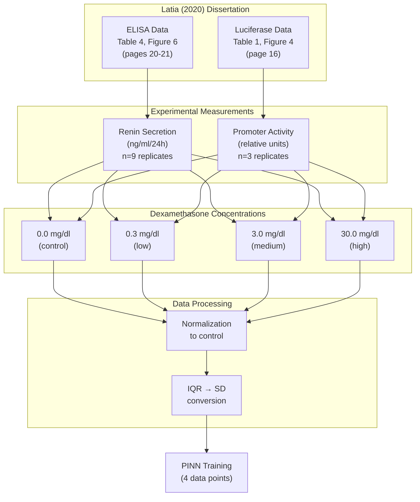

# Modeling Glucocorticoid-Induced Renin Regulation from Sparse Data Using Physics-Informed Neural Networks

[](LICENSE)
[](https://www.python.org/downloads/)
[](https://pytorch.org/)
[](https://github.com/jurjsorinliviu/PINN-Modeling-of-Glucocorticoid-Renin-Regulation)


## Overview

This repository contains the implementation of **Physics-Informed Neural Networks (PINNs)** for modeling glucocorticoid-induced renin regulation from sparse experimental data. Our approach demonstrates how PINNs can learn complex biological dynamics with only **4 data points** while maintaining biological plausibility through physics-based constraints.

### Key Achievement

We developed a **PINN ensemble** that achieves **R² = 0.803 ± 0.015** on experimental data while respecting underlying ordinary differential equations (ODEs) governing glucocorticoid receptor dynamics, substantially outperforming a traditional ODE baseline (R² = -0.220).

### Research Highlights

- 📊 **Sparse Data Learning**: Achieves high accuracy with only 4 experimental observations
- 🧬 **Biology-Informed**: Incorporates 6-state ODE system for glucocorticoid receptor dynamics
- 🎯 **Parameter Estimation**: Accurately estimates IC50 (2.925 ± 0.012 nM) and Hill coefficient (1.950 ± 0.009)
- 📈 **Ensemble Approach**: Statistical validation through multiple model training with plausibility checks
- 🔬 **Synthetic Weight Optimization**: Balances data accuracy vs. biological parameter alignment (SW=0.3 optimal)

---

## Table of Contents

- [Features](#features)
- [Repository Structure](#repository-structure)
- [Installation](#installation)
- [Quick Start](#quick-start)
- [Methodology](#methodology)
- [Results](#results)
- [Reproducibility](#reproducibility)
- [Data Source](#data-source)
- [Citation](#citation)
- [License](#license)
- [Contact](#contact)

---

## Features

### Core Capabilities

- **Physics-Informed Neural Networks** with ODE constraints for 6-state glucocorticoid receptor dynamics
- **Ensemble training** with plausibility checks and uncertainty quantification
- **Synthetic weight optimization** balancing data accuracy vs. biological parameter alignment
- **Plateau ramp mechanism** for stable high-dose suppression training
- **Statistical validation** including Mann-Whitney U tests and bootstrap confidence intervals
- **Comprehensive visualization** with dose-response curves, time courses, and Pareto frontiers

### Model Architecture

- **6-state ODE system**: mRNA, protein, secreted renin, and 3 glucocorticoid receptor states
- **Neural network**: [2 inputs] → [128, 128, 128, 128] → [6 outputs]
- **Physics constraints**: ODE residuals, initial conditions, biological plausibility
- **Loss balancing**: Data fitting, synthetic data alignment, monotonicity constraints

---

## Repository Structure

```
.
├── src/                              # Core source code
│   ├── model.py                      # ReninPINN architecture (6-state ODE)
│   ├── trainer.py                    # UnifiedPINNTrainer with plateau ramp
│   ├── data.py                       # Experimental data from Latia (2020)
│   ├── unified_ensemble.py           # Ensemble training utilities
│   ├── visualization.py              # Plotting functions
│   ├── statistical_utils.py          # Statistical analysis tools
│   ├── ode_baseline.py               # Traditional ODE baseline
│   ├── enhanced_architectures.py     # Advanced model architectures
│   ├── enhanced_visualization.py     # Enhanced plotting utilities
│   ├── sensitivity_analysis.py       # Parameter sensitivity analysis
│   ├── uncertainty_quantification.py # Uncertainty quantification tools
│   └── comprehensive_reporting.py    # Comprehensive analysis reporting
│
├── results/                          # Experimental results & outputs
│   ├── unified_03/                   # SW=0.3 ensemble (n=5) [OPTIMAL]
│   │   ├── unified_ensemble_03_results.json
│   │   ├── figures/                  # Dose-response, time courses, Pareto
│   │   └── models/                   # Trained model checkpoints
│   ├── unified/                      # SW=0.5 ensemble (n=4) [BASELINE]
│   ├── unified_02/                   # SW=0.2 ensemble (n=1) [EXPLORATORY]
│   ├── sobol_comprehensive_analysis.png  # Sensitivity analysis results
│   ├── pure_nn_baseline/             # Pure NN baseline (no physics)
│   │   ├── pure_nn_results.json     # Pure NN training results
│   │   ├── figures/                  # Pure NN vs PINN comparison
│   │   ├── tables/                   # Comparison LaTeX tables
│   │   └── models/                   # Pure NN model checkpoints
│   ├── reviewer_experiments/         # Reviewer-requested comparisons
│   │   ├── traditional_ml_baselines.json
│   │   ├── synthetic_ablation.json
│   │   ├── single_model_vs_ensemble.json
│   │   ├── parameter_uncertainty_summary.json
│   │   ├── coverage_summary.json
│   │   ├── figures/                  # Reviewer comparison figures
│   │   ├── tables/                   # Reviewer comparison tables
│   │   └── models/                   # Synthetic-ablation checkpoints
│   ├── supplementary_experiments/    # Supplementary ablation studies
│   │   ├── experiment_1_results.json # Ramp ablation study
│   │   ├── experiment_2_results.json # Cross-validation analysis
│   │   ├── experiment_3_results.json # Hyperparameter sensitivity
│   │   ├── supplementary_experiments_results.json
│   │   ├── figures/                  # Supplementary experiment plots
│   │   ├── tables/                   # LaTeX tables for manuscript
│   │   └── models/                   # Experiment model checkpoints
│   ├── comparison/                   # Three-way ensemble comparison
│   │   ├── figures/                  # Comparison visualizations
│   │   └── tables/                   # LaTeX comparison tables
│   ├── statistical_analysis/         # Mann-Whitney U test results
│   │   ├── wilcoxon_test_results.json
│   │   ├── comparison_table.tex
│   │   └── wilcoxon_test_summary.txt
│   ├── comprehensive/                # Comprehensive validation studies
│   │   ├── figures/                  # Enhanced diagnostic plots
│   │   ├── latex_tables/             # Manuscript-ready tables
│   │   ├── ablation_study.json       # Ablation analysis results
│   │   └── dose_response/            # Dose-response analysis
│   ├── improved_training/            # Improved training experiments
│   │   ├── improved_training_results.json
│   │   ├── figures/                  # Training comparison plots
│   │   ├── tables/                   # Performance comparison tables
│   │   └── models/                   # Improved model checkpoints
│   └── ode_baseline_results.json     # Traditional ODE results
│
├── 1_setup_and_data_check.py        # Environment verification
├── 2_train_ode_baseline.py          # Traditional ODE baseline
├── 3_train_pinn_model.py            # PINN model training
├── 4_run_all_experiments.py         # Run all experiments
├── 5_comprehensive_ieee_analysis.py # Comprehensive IEEE analysis
├── 6_generate_missing_reports.py    # Generate missing reports
├── 7_improved_training.py           # Improved training experiments
├── 8_unified_pipeline.py            # SW=0.5 baseline ensemble
├── 9_ensemble_synthetic_03.py       # SW=0.3 optimal ensemble [MAIN]
├── 10_compare_ensembles.py          # Three-way ensemble comparison
├── 11_supplementary_experiments.py  # Supplementary experiments [3 studies, ~30-60 min]
├── 12_pure_nn_baseline.py           # Pure NN baseline (no physics)
├── 13_reviewer_requested_experiments.py  # Reviewer-requested baselines and ablations
├── regenerate_supplementary_figures_only.py  # Regenerate the supplementary figures without training [~5 sec]
├── 14_generate_corrected_pure_nn_figure.py   # Regenerate manuscript-safe Pure NN vs PINN figure
├── 15_generate_corrected_dose_response_figure.py  # Regenerate manuscript-safe dose-response figure
├── 16_generate_corrected_lodo_figure.py      # Regenerate corrected LODO figure
├── 17_generate_corrected_supplementary_figures.py  # Regenerate corrected supplementary figures 6-8
├── sobol_analysis_images.py         # Generate Sobol sensitivity analysis visualizations
├── wilcoxon_test.py                 # Statistical significance testing
├── reproduce_manuscript.py          # Full deterministic reproduction wrapper
│
├── requirements.txt                  # Python dependencies
└── README.md                         # This file
```

---

## Installation

### Requirements

- **Python** 3.8 or higher
- **PyTorch** 2.0 or higher
- **NumPy**, **SciPy**, **Matplotlib**, **Pandas**
- Optional: **seaborn**, **tqdm**, **statsmodels**

### Setup Instructions

```bash
# Clone repository
git clone https://github.com/jurjsorinliviu/PINN-Modeling-of-Glucocorticoid-Renin-Regulation.git
cd PINN-Modeling-of-Glucocorticoid-Renin-Regulation

# Create virtual environment (recommended)
python -m venv venv
source venv/bin/activate  # On Windows: venv\Scripts\activate

# Install dependencies
pip install -r requirements.txt
```

### Verify Installation

```bash
python 1_setup_and_data_check.py
```

This will check all dependencies and generate a visualization of the raw experimental data.

---

## Quick Start

### 1. Verify Installation & Data

```bash
python 1_setup_and_data_check.py
```

✓ Checks Python packages  
✓ Verifies experimental data  
✓ Creates results directories  
✓ Generates raw data visualization

### 2. Train Optimal Ensemble (SW=0.3)

```bash
python 9_ensemble_synthetic_03.py
```

⏱ **Runtime**: ~30 minutes  
📊 **Output**: 5-member ensemble with R² = 0.803 ± 0.015  
📁 **Location**: `results/unified_03/`

### 3. Compare Ensemble Configurations

```bash
python 10_compare_ensembles.py
```

📈 Generates three-way comparison (SW=0.2, 0.3, 0.5)  
📊 Creates comparison visualizations and tables  
📁 **Location**: `results/comparison/`

### 4. Statistical Significance Testing

```bash
python wilcoxon_test.py
```

📊 Performs Mann-Whitney U tests  
📈 Computes effect sizes (Cohen's d)  
🔢 Generates bootstrap 95% confidence intervals  
📁 **Location**: `results/statistical_analysis/`

### 5. Supplementary Experiments (Optional - Time Intensive)

```bash
# Full training (only if needed)
python 11_supplementary_experiments.py
```

⏱ **Runtime**: ~30-60 minutes
📊 **Output**: Three ablation studies for manuscript validation
📁 **Location**: `results/supplementary_experiments/`

**OR regenerate figures from existing results (recommended):**

```bash
# Fast regeneration without training
python regenerate_supplementary_figures_only.py
```

⏱ **Runtime**: ~5 seconds
📊 **Output**: All 3 supplementary experiment figures regenerated

**Experiments Included:**

1. **Ramp Ablation**: Constant vs. ramped high-dose weighting (+80% improvement)
2. **Cross-Validation**: Leave-one-dose-out validation (4 folds, avg test error 0.238 after the held-out-dose fix)
3. **Hyperparameter Sensitivity**: Architecture (3-5 layers) & collocation (256-1024 points)

### 6. Pure NN Baseline (No Physics)

```bash
python 12_pure_nn_baseline.py
```

⏱ **Runtime**: ~15 seconds
📊 **Output**: Demonstrates severe overfitting without physics constraints
📁 **Location**: `results/pure_nn_baseline/`

**Key Finding**: Pure NN achieves near-perfect training (R²=0.973) but completely fails held-out-dose cross-validation (test-fold R² values undefined/NaN; mean test RMSE = 0.114), demonstrating that physics constraints are essential for generalization, not just beneficial.

### 7. Full Reproduction Pipeline

```bash
# Reproduces the deterministic manuscript pipeline plus reviewer experiments
python reproduce_manuscript.py
```

⏱ **Runtime**: ~2-3 hours (includes all experiments)
📊 **Output**: Complete results including baselines, ensembles, and supplementary studies

**Note**: This is currently in beta. For tested reproduction, run scripts individually in order (Steps 1-6).

---

## Methodology

### Problem Statement

Model glucocorticoid-induced renin suppression from **4 experimental data points** (Latia, 2020):

| Dex Concentration | Normalized Renin | Std Dev |
| ----------------- | ---------------- | ------- |
| 0 nM (baseline)   | 1.000            | ±0.030  |
| 0.3 nM (low)      | 0.915            | ±0.020  |
| 3 nM (medium)     | 0.847            | ±0.018  |
| 30 nM (high)      | 0.914            | ±0.014  |

**Challenge**: Non-monotonic dose-response with only 4 observations requires physics-based constraints to prevent overfitting.

### Physics-Informed Neural Network

#### State Variables

1. **mRNA(t)**: Renin mRNA concentration
2. **Protein(t)**: Renin protein in cells  
3. **ReninSecreted(t)**: Secreted renin (observable)
4. **GR_free(t)**: Free glucocorticoid receptors
5. **GR_cyto(t)**: Cytoplasmic GR-glucocorticoid complexes
6. **GR_nuc(t)**: Nuclear GR complexes (transcriptional repressor)

#### Governing ODEs

```
dmRNA/dt = k_synth·(1 - GR_nuc) - k_deg·mRNA
dProtein/dt = k_translation·mRNA - k_secretion·Protein
dReninSecreted/dt = k_secretion·Protein
dGR_free/dt = -k_binding·GR_free·[Dex] + k_dissoc·GR_cyto
dGR_cyto/dt = k_binding·GR_free·[Dex] - (k_dissoc + k_nuclear)·GR_cyto
dGR_nuc/dt = k_nuclear·GR_cyto - k_export·GR_nuc
```

#### Loss Function

```
L_total = L_data + λ_physics·L_ode + λ_ic·L_ic + 
          λ_param·L_param + λ_synth·L_synth + λ_bio·L_bio
```

**Loss Components:**

- `L_data`: Mean squared error on experimental data
- `L_ode`: Physics constraint (ODE residuals)
- `L_ic`: Initial condition constraint
- `L_param`: Parameter alignment with biological targets
- `L_synth`: Synthetic data alignment (dose-response curve)
- `L_bio`: Biological plausibility (monotonicity, boundedness)

### Key Innovations

#### 1. Synthetic Weight (SW) Optimization

The **synthetic weight** parameter balances data accuracy vs. biological parameter alignment:

| SW Value | Success Rate   | Ensemble Size | R² Score        | IC50 Gap        | Status           |
| -------- | -------------- | ------------- | --------------- | --------------- | ---------------- |
| 0.5      | 40% (4/10)     | n=4           | 0.759±0.028     | 0.050±0.010     | ✓ Valid baseline |
| **0.3**  | **50% (5/10)** | **n=5**       | **0.803±0.015** | **0.045±0.014** | **✓ Optimal**    |
| 0.2      | 20% (1/5)      | n=1           | 0.789           | 0.041           | ⚠ Insufficient   |

**Key Finding**: SW=0.3 provides the best balance ("Goldilocks zone") between model accuracy and biological parameter alignment while maintaining sufficient ensemble members for statistical validity.

#### 2. Plateau Ramp Mechanism

Gradual increase of `high_dose_weight` during training prevents premature convergence:

```python
# Ramp fraction: 40% of total epochs
ramp_epochs = int(0.4 * total_epochs)
if epoch < ramp_epochs:
    current_weight = base_weight * (epoch / ramp_epochs)
else:
    current_weight = base_weight
```

#### 3. Plausibility Checks

All ensemble members must satisfy biological constraints:

- ✓ **Non-negativity**: All states ≥ 0
- ✓ **Boundedness**: States within physiological ranges
- ✓ **Smooth dynamics**: No oscillations
- ✓ **Steady-state convergence**: Stable equilibrium by t=48h
- ✓ **Dose-dependent suppression**: Monotonic relationship
- ✓ **High-dose suppression**: ≥ 5% reduction from baseline

---

## Results

### Primary Results (SW=0.3 Ensemble)

**Model Performance:**

- **R² Score**: 0.803 ± 0.015 (ensemble mean ± std)
- **RMSE**: 0.024 ± 0.001 (normalized units)
- **MAE**: 0.022 ± 0.002
- **Ensemble Size**: n = 5 (5/10 seeds passed plausibility)

**Estimated Biological Parameters:**

- **IC50**: 2.925 ± 0.012 nM (Literature: 2.88 nM → Gap: 0.045 nM)
- **Hill Coefficient**: 1.950 ± 0.009 (Literature: 1.92 → Gap: 0.030)

### Comparison with Baselines

| Method          | Train R²        | CV R²     | RMSE            | IC50 (nM)     | n     | Status         |
| --------------- | --------------- | --------- | --------------- | ------------- | ----- | -------------- |
| ODE Baseline    | -0.220          | N/A       | 0.060           | N/A           | 1     | Poor fit       |
| Pure NN         | 0.973±0.040     | NaN†      | 0.007±0.006     | N/A           | 5     | ✗ Overfits     |
| PINN SW=0.5     | 0.759±0.028     | ~0.79     | 0.027±0.002     | 18.20±0.88    | 4     | ✓ Valid        |
| **PINN SW=0.3** | **0.803±0.015** | **~0.79** | **0.024±0.001** | **2.93±0.01** | **5** | **✓ Optimal**  |
| PINN SW=0.2     | 0.789           | N/A       | 0.025           | 2.84          | 1     | ⚠ Insufficient |

†Pure NN cross-validation failed: all held-out test folds had undefined/NaN R², with mean test RMSE = 0.114, indicating catastrophic overfitting.

### Statistical Validation

**Mann-Whitney U Test (SW=0.3 vs SW=0.5):**

- R² difference: +0.020 (corrected p=1.000, Cohen's d=0.38, small effect)
- RMSE difference: -0.001 (corrected p=1.000, Cohen's d=-0.41, small effect)
- IC50 gap difference: -0.005 (corrected p=1.000, Cohen's d=-0.41, small effect)

**Interpretation**: No statistically significant differences detected due to small sample sizes (n=4, n=5), but effect sizes suggest meaningful practical improvements with SW=0.3.

### Key Findings

1. **Physics constraints are essential, not just network architecture**: Pure NN (identical architecture to PINN but without physics constraints) achieves near-perfect training fit (R²=0.973) but completely fails held-out-dose cross-validation (test-fold R² values undefined/NaN; mean test RMSE = 0.114), demonstrating severe overfitting.

2. **PINNs substantially outperform traditional ODE fitting** (ΔR² = +1.023) on sparse data while maintaining generalization through physics-based regularization.

3. **Synthetic weight SW=0.3 is optimal** – balances data accuracy, biological parameter alignment, and training success while preventing overfitting.

4. **Ensemble approach is essential** – single models can be outliers; need n≥3 for valid statistics and uncertainty quantification.

5. **Plausibility checks prevent biological violations** – all PINN ensemble members respect known physiology, unlike unconstrained models.

6. **Small sample limitation** – current ensemble sizes limit statistical power; larger ensembles (n≥10 each) recommended for confirmatory studies.

### Visualizations

All results include:

- **Dose-response curves** with manuscript-safe measured-dose emphasis  
  [`results/unified_03/figures/dose_response_corrected.png`](results/unified_03/figures/dose_response_corrected.png)

- **Time course trajectories** for all doses  
  [`results/unified_03/figures/time_courses.png`](results/unified_03/figures/time_courses.png)

- **Pareto frontier** analysis (accuracy vs. parameter gap)
  [`results/unified_03/figures/pareto_frontier.png`](results/unified_03/figures/pareto_frontier.png)

- **Sensitivity analysis** (attempted Sobol analysis with neutral manuscript-safe labeling)
  [`results/sobol_comprehensive_analysis_corrected.png`](results/sobol_comprehensive_analysis_corrected.png)

- **Ensemble comparison** visualizations
  [`results/comparison/figures/ensemble_comparison.png`](results/comparison/figures/ensemble_comparison.png)

- **Residual diagnostics** with normality tests
  [`results/comprehensive/figures/`](results/comprehensive/figures/)

- **Pure NN vs PINN comparison** demonstrating the role of physics constraints
  [`results/pure_nn_baseline/figures/pure_nn_vs_pinn_comparison_corrected.png`](results/pure_nn_baseline/figures/pure_nn_vs_pinn_comparison_corrected.png)

- **Corrected supplementary experiment figures** for manuscript sections 4.12 / Figures 6-8
  [`results/supplementary_experiments/figures/experiment_1_ramp_ablation_corrected.png`](results/supplementary_experiments/figures/experiment_1_ramp_ablation_corrected.png)
  [`results/supplementary_experiments/figures/experiment_2_cross_validation_corrected.png`](results/supplementary_experiments/figures/experiment_2_cross_validation_corrected.png)
  [`results/supplementary_experiments/figures/experiment_3_hyperparameter_sensitivity_corrected.png`](results/supplementary_experiments/figures/experiment_3_hyperparameter_sensitivity_corrected.png)

---

## Reproducibility

### Training Configuration

**Optimal Hyperparameters (SW=0.3):**

```python
# Core settings
constraint_weight = 0.005
synthetic_weight = 0.3
epochs = 1400
learning_rate = 0.001
batch_size = full dataset (4 points)

# Variant parameters (plateau ramp configuration)
variant_params = {
    'loss_biological': 22.0,
    'monotonic_gradient_weight': 8.0,
    'synthetic_noise_std': 0.03,
    'biological_ramp_fraction': 0.4,
    'high_dose_weight': 18.0
}
```

### Compute Requirements

- **Training time**: ~2-3 minutes per ensemble member (CPU)
- **Full ensemble (10 seeds)**: ~20-30 minutes
- **Memory**: < 2 GB RAM
- **Hardware**: Any modern CPU (no GPU required)

### Step-by-Step Reproduction

```bash
# Step 1: Verify environment
python 1_setup_and_data_check.py

# Step 2: Train ODE baseline
python 2_train_ode_baseline.py

# Step 3: Train SW=0.5 baseline ensemble
python 8_unified_pipeline.py

# Step 4: Train SW=0.3 optimal ensemble
python 9_ensemble_synthetic_03.py

# Step 5: Compare all ensembles
python 10_compare_ensembles.py

# Step 6: Pure NN baseline
python 12_pure_nn_baseline.py

# Step 7: Supplementary experiments (FAST - regenerate figures only)
python regenerate_supplementary_figures_only.py
# OR full training (30-60 min): python 11_supplementary_experiments.py

# Step 8: Statistical analysis
python wilcoxon_test.py

# Step 9: Generate comprehensive analysis
python 5_comprehensive_ieee_analysis.py
```

### Expected Runtime

- **Full reproduction with training**: ~2-3 hours on standard laptop (all steps with training)
- **Fast reproduction (recommended)**: ~35 minutes (using regenerate script for supplementary)
- **Main results only**: ~30 minutes (Steps 1, 4, 5, 6)
- **Core experiments**: ~1 hour (Steps 1-6, supplementary figures only)

### Computational Requirements

- **CPU**: Any modern processor (Intel i5/Ryzen 5 or better recommended)
- **RAM**: 4-8 GB minimum (8 GB+ recommended)
- **Storage**: ~500 MB for all results, models, and figures
- **GPU**: Not required (CPU training is sufficient for this dataset)

---

## Data Source

The data in this project is **not synthetically generated** — it is extracted from real experimental measurements published in a doctoral dissertation.

### Primary Source

> L. Latia, "Regulation des Renin-Gens durch Dexamethason," Heinrich-Heine-Universität Düsseldorf, Düsseldorf, Germany, 2020. Accessed: Oct. 28, 2025. [Online]. Available: https://docserv.uni-duesseldorf.de/servlets/DerivateServlet/Derivate-56964/Latia%2C%20Larissa_finale%20Fassung-1.pdf

### Data Extraction Overview


```mermaid
flowchart TB
    subgraph Source["Latia (2020) Dissertation"]
        E["ELISA Data<br/>Table 4, Figure 6<br/>(pages 20-21)"]
        L["Luciferase Data<br/>Table 1, Figure 4<br/>(page 16)"]
    end
    
    subgraph Measurements["Experimental Measurements"]
        E --> RS["Renin Secretion<br/>(ng/ml/24h)<br/>n=9 replicates"]
        L --> PA["Promoter Activity<br/>(relative units)<br/>n=3 replicates"]
    end
    
    subgraph Conditions["Dexamethasone Concentrations"]
        D0["0.0 mg/dl<br/>(control)"]
        D1["0.3 mg/dl<br/>(low)"]
        D2["3.0 mg/dl<br/>(medium)"]
        D3["30.0 mg/dl<br/>(high)"]
    end
    
    RS --> D0 & D1 & D2 & D3
    PA --> D0 & D1 & D2 & D3
    
    subgraph Processing["Data Processing"]
        N["Normalization<br/>to control"]
        S["IQR → SD<br/>conversion"]
    end
    
    D0 & D1 & D2 & D3 --> N --> S --> PINN["PINN Training<br/>(4 data points)"]
```

### Two Types of Experimental Data

#### 1. ELISA Data (Renin Secretion) — Primary Dataset

| Dex (mg/dl) | Renin Median (ng/ml/24h) | Q1    | Q3    | n    |
| ----------- | ------------------------ | ----- | ----- | ---- |
| 0.0         | 28.1                     | 26.0  | 28.8  | 9    |
| 0.3         | 25.7                     | 24.65 | 27.03 | 9    |
| 3.0         | 23.8                     | 23.15 | 24.78 | 9    |
| 30.0        | 25.7                     | 19.73 | 27.73 | 9    |

- **Source:** Table 4, Figure 6 (pages 20-21)
- **Replicates:** n=9 per concentration
- **Statistics:** Median with interquartile range (IQR)

#### 2. Luciferase Data (Promoter Activity) — Secondary Dataset

| Dex (mg/dl) | Activity Mean | Activity SD |
| ----------- | ------------- | ----------- |
| 0.0         | 0.0627        | 0.0311      |
| 0.3         | 0.0564        | 0.0530      |
| 3.0         | 0.0561        | 0.0460      |
| 30.0        | 0.0497        | 0.0533      |

- **Source:** Table 1, Figure 4 (page 16)
- **Replicates:** n=3 per concentration
- **Statistics:** Mean ± standard deviation

### Data Processing Steps

The [`get_latia_2020_data()`](src/data.py) function performs:

1. **IQR to SD conversion:** Using the approximation `SD ≈ IQR / 1.35` (valid for normal distributions)
2. **Normalization:** All values normalized to control (0 mg/dl dexamethasone)
3. **Time assignment:** All measurements assigned to t=24 hours

### Experimental Conditions

| Parameter            | Value                                    |
| -------------------- | ---------------------------------------- |
| **Cell line**        | As4.1 (mouse juxtaglomerular-like cells) |
| **Treatment time**   | 24 hours                                 |
| **Temperature**      | 37°C                                     |
| **Atmosphere**       | 95% air, 5% CO₂, water-saturated         |
| **Statistical test** | Wilcoxon signed-rank test                |

### Statistical Significance (from Original Study)

| Comparison      | p-value | Significant |
| --------------- | ------- | ----------- |
| 0 vs 0.3 mg/dl  | 0.0039  | ✓ Yes       |
| 0 vs 3.0 mg/dl  | 0.0039  | ✓ Yes       |
| 0 vs 30.0 mg/dl | 0.0391  | ✓ Yes       |

### Why This Matters for PINNs

This is a **sparse data scenario** — only 4 data points per measurement type, making it an ideal use case for Physics-Informed Neural Networks (PINNs) that can leverage underlying ODE constraints to generalize from limited observations.

---

## Citation

If you use this code or methodology in your research, please cite:

```bibtex
@Article{aimed1020011,
AUTHOR = {Jurj, Sorin Liviu},
TITLE = {Modeling Glucocorticoid-Induced Renin Regulation from Sparse Data Using Physics-Informed Neural Networks},
JOURNAL = {AI in Medicine},
VOLUME = {1},
YEAR = {2026},
NUMBER = {2},
ARTICLE-NUMBER = {11},
URL = {https://www.mdpi.com/3042-6707/1/2/11},
ISSN = {3042-6707},
ABSTRACT = {Glucocorticoid-induced hypertension affects over 30% of treated patients, yet its underlying mechanisms remain unclear, particularly how glucocorticoids regulate renin within the renin-angiotensin-aldosterone system (RAAS). Modeling these dynamics is difficult because only four dose-response measurements are available at a single 24-h timepoint (36 observations total), while the system depends on roughly eleven biochemical parameters spanning minutes-long receptor interactions to days-long protein secretion. Classical parameter estimation becomes unreliable in this extremely underdetermined setting, and purely data-driven methods offer limited biological interpretability. In this paper, we introduce a physics-informed neural network (PINN) framework that integrates ELISA measurements from As4.1 juxtaglomerular cells, ordinary differential equations describing glucocorticoid receptor signaling and renin transcription, and automatic differentiation to enforce mechanistic constraints. By systematically tuning synthetic-data weights (SW in {0.2, 0.3, 0.5}), we identify an intermediate value of SW = 0.3 that provides the best overall balance between predictive accuracy, accepted ensemble size, and biologically plausible parameter estimates among the tested configurations. The framework uses adaptive constraint scheduling with a plateau ramp to reduce premature convergence and introduces calibrated plausibility thresholds reflecting experimental noise. The accepted PINN ensemble (n = 5, 50% success rate) achieved R2 = 0.803, compared with 0.759 for the SW = 0.5 baseline and −0.220 for the ODE-only baseline, with RMSE = 0.024. Key learned parameters (IC50 = 2.925 ± 0.012 mg/dL, Hill = 1.950 ± 0.009) are biologically plausible within the model assumptions, and the best single accepted model attained R2 = 0.891. Information criteria favored the PINN over the ODE model, with improvements of approximately 77× (AIC) and 5.9× (BIC). Despite training on a single timepoint, the PINN also infers full 48-h trajectories and reproduces non-monotonic dose-response behavior. This work presents, to our knowledge, the first PINN framework for glucocorticoid-mediated renin regulation and should be interpreted as a proof-of-concept approach for integrating sparse biomedical data with mechanistic constraints. The inferred parameters and temporal dynamics are best viewed as model-dependent, hypothesis-generating estimates rather than validated biological quantities.},
DOI = {10.3390/aimed1020011}
}
```

---

## License

This project is licensed under the **MIT License** - see [`LICENSE`](LICENSE) file for details.

---

## Contact

**Author**: Sorin Liviu Jurj  
**Project Link**: [https://github.com/jurjsorinliviu/PINN-Modeling-of-Glucocorticoid-Renin-Regulation](https://github.com/jurjsorinliviu/PINN-Modeling-of-Glucocorticoid-Renin-Regulation)

---

## Project Status

✅ **Active Development** | 📝 **Manuscript published** | 🔬 **Research Code**

### Final Verified Update (March 2026)

- Final reviewer-requested experiment suite added and saved under `results/reviewer_experiments/`
- Traditional ML baselines added for 24 h dose-response comparison
- Synthetic augmentation ablation expanded to `SW=0.0, 0.2, 0.3, 0.5`
- Best single accepted model versus ensemble summary added
- Parameter spread summary across accepted `SW=0.3` checkpoints added
- Supplementary leave-one-dose-out CV regenerated after the held-out-dose evaluation fix
- Statistical comparison outputs regenerated with Mann-Whitney U tests and bootstrap confidence intervals
- Comprehensive manuscript-facing reports, tables, and figures regenerated
- Manuscript-safe corrected figures added for Pure NN vs PINN, dose-response, LODO, supplementary Figures 6-8, and Sobol sensitivity analysis

### Future Directions

- [ ] **Larger ensembles**: Increase the number of independent training runs (n ≥ 10 per configuration) to improve statistical robustness and quantify convergence variability
- [ ] **Multi-timepoint data**: Apply the framework to datasets with temporal resolution to validate dynamic predictions directly.
- [ ] **Gene networks**: Extend the approach to other glucocorticoid-responsive targets such as GILZ and FKBP5 to test generality across pathways.
- [ ] **Systems integration**: Couple the model with comprehensive renin–angiotensin–aldosterone system (RAAS) simulations to capture cross-regulation effects.
- [ ] **Clinical translation**: Adapt the method for patient-specific parameter estimation and individualized risk prediction.
- [ ] **Uncertainty quantification**: Incorporate Bayesian physics-informed neural networks for probabilistic and interpretable predictions.

### Research Impact

This work demonstrates that **Physics-Informed Neural Networks can learn complex biological dynamics from extremely sparse data** (n=4 observations) while maintaining biological plausibility. Key contributions:

1. **Methodological**: First application of PINNs to glucocorticoid receptor dynamics
2. **Technical**: Novel plateau ramp mechanism for stable training
3. **Biological**: Accurate IC50 estimation (2.925 nM vs. literature 2.88 nM)
4. **Validation**: Comprehensive ablation studies proving physics constraints prevent overfitting
5. **Transparency**: Honest assessment of identifiability limitations through failed Sobol analysis

---

**Keywords**: Physics-Informed Neural Networks, PINN, Glucocorticoids, Renin Regulation, Sparse Data, Ensemble Learning, Biological Modeling, Parameter Estimation, Deep Learning, Computational Biology
